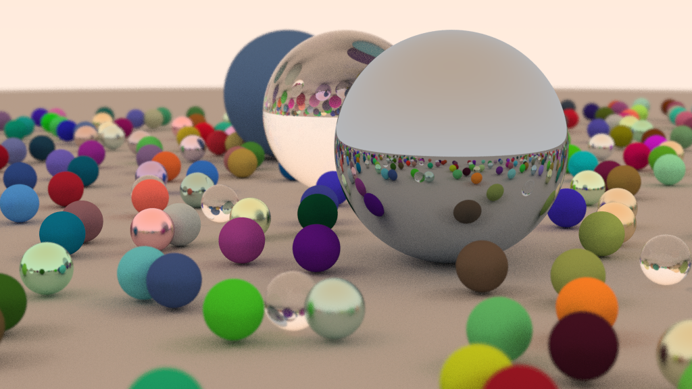
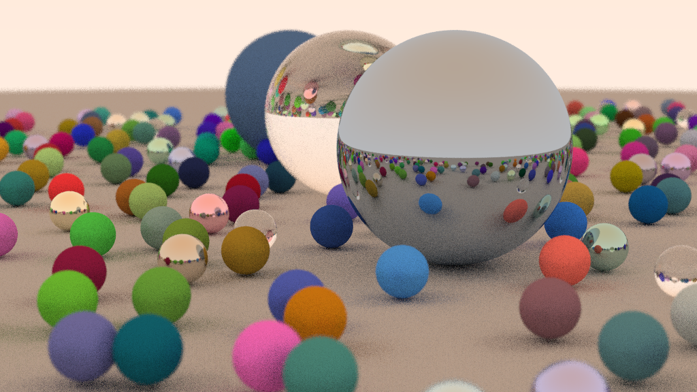

Parallel Ray Tracing with CUDA
===

Implement the parallel version of ray tracing with CUDA.

Build
---
```bash
$ make
```

Run
---
- Single GPU version
  ```bash
  $ ./main output.png
  ```
- Multi-GPU version
  ```bash
  $ ./main_multi output.png
  ```

Demonstration
---

### samples per pixel = 100


### samples per pixel = 20

